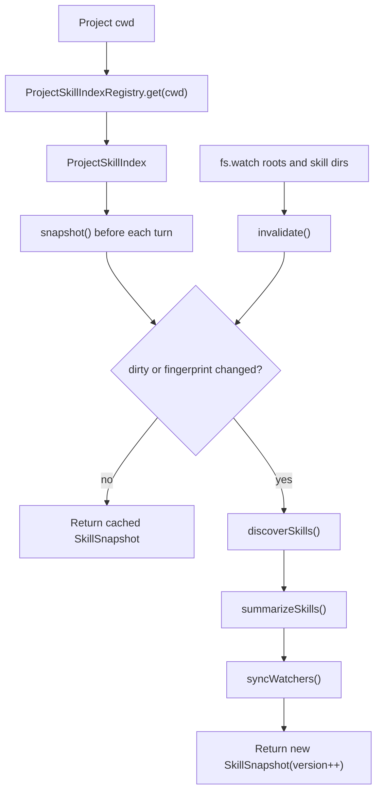

# Skills

This document describes the current Skills implementation. It is not a
marketplace or plugin system. Skills are local `SKILL.md` instruction bundles
that are discovered per project, summarized in the system prompt, and loaded on
demand through the `skill` tool.

## Goals

- Keep full `SKILL.md` content out of the prompt until the model explicitly
  needs it.
- Let users add, edit, or delete project skills without refreshing the browser
  or restarting the app server.
- Keep provider/model/runtime instances stable when skills change.
- Reuse the same session loop, tool registry, permission system, and transcript
  storage across Web, CLI, and TUI.

## Skill File Format

A skill is a `SKILL.md` file with frontmatter. The minimum accepted fields are
`name` and `description`.

```md
---
name: say-hello
description: Say hello in a predictable format.
---

# Say Hello

When this skill is loaded, answer with: Hello from the say-hello skill.
```

Invalid skill files are skipped. A missing frontmatter block, missing `name`, or
missing `description` does not fail server startup or turn execution.

## Discovery Roots

`discoverSkills()` scans these roots for `**/SKILL.md`:

| Scope | Roots |
| --- | --- |
| `workspace` | `<project>/.agents/skills`, `<project>/.claude/skills`, `<project>/.opencode/skill`, `<project>/.opencode/skills` |
| `myagent` | `$MYAGENT_HOME/skills`, or `~/.myagent/skills` when `MYAGENT_HOME` is not set |
| `global` | `~/.agents/skills`, `~/.claude/skills` |

When multiple skills share the same `name`, only one is kept. Priority follows
root order: workspace first, then myAgent home, then global home roots.

## Data Model

The runtime uses two skill shapes:

```ts
type SkillInfo = {
  name: string
  description: string
  location: string
  content: string
  scope: "workspace" | "myagent" | "global"
  baseDir: string
}

type SkillSummary = {
  name: string
  description: string
  scope: "workspace" | "myagent" | "global"
}
```

`SkillInfo` is used to build the actual `skill` tool. `SkillSummary` is the only
skill data sent in the initial system prompt.

## ProjectSkillIndex

Skills are indexed per project path. `ProjectSkillIndexRegistry` stores one
`ProjectSkillIndex` per resolved project cwd.

`ProjectSkillIndex.snapshot()` returns:

```ts
type SkillSnapshot = {
  skills: SkillInfo[]
  availableSkills: SkillSummary[]
  version: number
}
```

The index has two refresh triggers:

- `fs.watch` watchers mark the project index dirty when known skill roots or
  skill directories change.
- A fingerprint fallback checks root directories, `SKILL.md` files, mtimes, and
  sizes on `snapshot()` so changes are still detected even when watcher events
  are missed.

This means skill add/modify/delete is detected on the next turn without a manual
refresh.



## Runtime Integration

Each run turn receives a fresh skill snapshot, but provider/model/runtime setup
is not rebuilt just because skills changed.

### Web

The app server caches the base runtime per project cwd:

- config
- model profiles
- provider factory
- approval mode

Before each turn, it resolves `ProjectSkillIndex.snapshot()` and returns a
runtime with:

- `registry: buildDefaultRegistry(snapshot.skills)`
- `availableSkills: snapshot.availableSkills`

`SessionManager.refreshRuntime()` updates the active session's registry and
available skills. The provider is only recreated when the selected model profile
changes.

### CLI and TUI

The interactive CLI and TUI also keep a `ProjectSkillIndexRegistry`. Before each
`runTurn()`, they call `snapshot()` and build the registry from that snapshot.

The effect is consistent across all entry points:

```mermaid
sequenceDiagram
  participant UI as Web / CLI / TUI
  participant Index as ProjectSkillIndex
  participant Registry as ToolRegistry
  participant Loop as runTurn()
  participant Provider as Provider

  UI->>Index: snapshot()
  Index-->>UI: SkillSnapshot
  UI->>Registry: buildDefaultRegistry(snapshot.skills)
  UI->>Loop: runTurn(provider, registry, availableSkills)
  Loop->>Provider: model stream with tool schemas and skill summary
```

## Prompt and Tool Loading

Skills use progressive disclosure.

At turn start, `buildSystemPrompt()` includes only:

- skill name
- scope
- description
- guidance telling the model to call `skill` only when the task clearly matches

It does not include full `SKILL.md` content.

When the model calls:

```json
{ "name": "skill", "input": { "name": "say-hello" } }
```

`src/tools/skill.ts` returns formatted content:

```xml
<skill_content name="say-hello">
# Skill: say-hello

...full SKILL.md body...

Base directory for this skill: file:///...
Relative paths in this skill (e.g. scripts/, reference/) are relative to this base directory.
Note: file list is sampled.

<skill_files>
<file>example.md</file>
</skill_files>
</skill_content>
```

Only the sampled file list is returned. Referenced files are not automatically
read into context.

```mermaid
sequenceDiagram
  participant Loop as Session Loop
  participant Model as Model
  participant Tool as skill tool

  Loop->>Model: system prompt with available skill summaries
  Model-->>Loop: tool-call skill(name)
  Loop->>Tool: execute({ name })
  Tool-->>Loop: full SKILL.md content as tool_result
  Loop->>Model: continue with tool_result
  Model-->>Loop: final assistant response
```

## Permission Behavior

Skill loading goes through the same permission engine as other tools. The
permission check receives prepared input with `name`, `scope`, and `location`.

| Approval mode | Workspace skill | myAgent/global skill | Missing skill |
| --- | --- | --- | --- |
| `auto` | allow | ask | deny |
| `on-request` | ask | ask | deny |
| `never` | deny | deny | deny |

Approval memory uses the skill name as the approval pattern. This is isolated
from file tools and shell tools by `toolName = "skill"`.

## Tool Display and Web UI

The session loop emits structured `ToolDisplay` for skill calls:

```ts
{
  kind: "skill",
  title: "Load skill",
  subtitle: "<skill name>",
  summary: "loaded"
}
```

The Web UI renders skill loads as lightweight tool rows:

- outer batch summary: `loaded 1 skill`
- icon: `icon-prompt`
- expanded child row: `Load skill <name> loaded`

The UI intentionally does not render the full `SKILL.md` body. The full skill
content is sent to the model as `tool_result.content`, but showing it to the
user would make the timeline noisy and expose implementation instructions.

## Storage and Compact

Skill tool results are stored like other tool results:

- `role: "tool_result"`
- `toolName: "skill"`
- `content`: formatted skill content
- `toolDisplay`: lightweight display metadata

The compact path treats `skill` output as protected from the tightest tool-output
cap so loaded instructions are less likely to be destroyed during transcript
compression. Compact still summarizes old transcript content through the active
provider.

## Current Limitations

- No marketplace install flow.
- No remote skill registry.
- No automatic loading of referenced files.
- No recursive sub-skill dependency model.
- No provider rebuild on skill change by design; if provider config changes,
  that is a separate config/runtime concern.
- Watchers are an invalidation optimization, not the only correctness mechanism;
  fingerprinting on `snapshot()` is the correctness fallback.

## Tests

The current behavior is covered by:

- `test/skill-discovery.test.ts`
- `test/skill-tool.test.ts`
- `test/skill-index.test.ts`
- `test/system-prompt.test.ts`
- `test/session-loop.test.ts`
- `test/app-server.test.ts`
- `test/tool-batch.test.ts`
