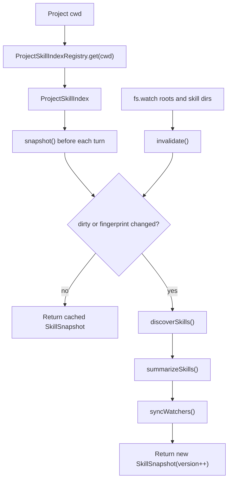

# Skills

本文档描述当前 Skills 实现。它不是 marketplace 或 plugin system。Skills 是本地 `SKILL.md` 指令包，会按项目发现，在 system prompt 中摘要展示，并通过 `skill` 工具按需加载。

## 目标

- 在模型明确需要之前，不把完整 `SKILL.md` 内容放进 prompt。
- 允许用户添加、编辑或删除 project skills，而不用刷新浏览器或重启 app server。
- Skills 变化时保持 provider/model/runtime instances 稳定。
- 在 Web、CLI、TUI 中复用同一套 session loop、tool registry、permission system 和 transcript storage。

## Skill File Format

Skill 是带 frontmatter 的 `SKILL.md` 文件。最小接受字段是 `name` 和 `description`。

```md
---
name: say-hello
description: Say hello in a predictable format.
---

# Say Hello

When this skill is loaded, answer with: Hello from the say-hello skill.
```

无效 skill 文件会被跳过。缺少 frontmatter block、缺少 `name` 或缺少 `description`，不会导致 server startup 或 turn execution 失败。

## Discovery Roots

`discoverSkills()` 会扫描这些 roots 下的 `**/SKILL.md`：

| Scope | Roots |
| --- | --- |
| `workspace` | `<project>/.agents/skills`, `<project>/.claude/skills`, `<project>/.opencode/skill`, `<project>/.opencode/skills` |
| `myagent` | `$MYAGENT_HOME/skills`，如果未设置 `MYAGENT_HOME` 则是 `~/.myagent/skills` |
| `global` | `~/.agents/skills`, `~/.claude/skills` |

当多个 skills 共享同一个 `name` 时，只保留一个。优先级遵循 root 顺序：workspace 优先，然后 myAgent home，最后 global home roots。

## Data Model

Runtime 使用两种 skill shape：

```ts
type SkillInfo = {
  name: string
  description: string
  location: string
  content: string
  scope: "workspace" | "myagent" | "global"
  baseDir: string
}

type SkillSummary = {
  name: string
  description: string
  scope: "workspace" | "myagent" | "global"
}
```

`SkillInfo` 用于构建真正的 `skill` tool。`SkillSummary` 是初始 system prompt 中唯一发送的 skill 数据。

## ProjectSkillIndex

Skills 按 project path 建索引。`ProjectSkillIndexRegistry` 为每个解析后的 project cwd 保存一个 `ProjectSkillIndex`。

`ProjectSkillIndex.snapshot()` 返回：

```ts
type SkillSnapshot = {
  skills: SkillInfo[]
  availableSkills: SkillSummary[]
  version: number
}
```

Index 有两个 refresh triggers：

- 当已知 skill roots 或 skill directories 变化时，`fs.watch` watchers 会把 project index 标记为 dirty。
- fingerprint fallback 会在 `snapshot()` 时检查 root directories、`SKILL.md` files、mtimes 和 sizes，因此即使 watcher events 丢失，变化仍然会被检测到。

这意味着 skill add/modify/delete 会在下一轮 turn 被检测到，不需要手动刷新。



## Runtime Integration

每个 run turn 都会收到新鲜的 skill snapshot，但 provider/model/runtime setup 不会仅因为 skills 变化而重建。

### Web

App server 会按 project cwd 缓存 base runtime：

- config
- model profiles
- provider factory
- approval mode

每个 turn 前，它解析 `ProjectSkillIndex.snapshot()`，并返回包含下面内容的 runtime：

- `registry: buildDefaultRegistry(snapshot.skills)`
- `availableSkills: snapshot.availableSkills`

`SessionManager.refreshRuntime()` 会更新 active session 的 registry 和 available skills。只有当选中的 model profile 变化时，provider 才会重建。

### CLI and TUI

交互式 CLI 和 TUI 也维护一个 `ProjectSkillIndexRegistry`。每次 `runTurn()` 前，它们都会调用 `snapshot()`，并从该 snapshot 构建 registry。

这样所有入口的效果一致：

```mermaid
sequenceDiagram
  participant UI as Web / CLI / TUI
  participant Index as ProjectSkillIndex
  participant Registry as ToolRegistry
  participant Loop as runTurn()
  participant Provider as Provider

  UI->>Index: snapshot()
  Index-->>UI: SkillSnapshot
  UI->>Registry: buildDefaultRegistry(snapshot.skills)
  UI->>Loop: runTurn(provider, registry, availableSkills)
  Loop->>Provider: model stream with tool schemas and skill summary
```

## Prompt and Tool Loading

Skills 使用 progressive disclosure。

Turn 开始时，`buildSystemPrompt()` 只包含：

- skill name
- scope
- description
- guidance，告诉模型只有当任务明确匹配时才调用 `skill`

它不包含完整 `SKILL.md` 内容。

当模型调用：

```json
{ "name": "skill", "input": { "name": "say-hello" } }
```

`src/tools/skill.ts` 返回格式化内容：

```xml
<skill_content name="say-hello">
# Skill: say-hello

...full SKILL.md body...

Base directory for this skill: file:///...
Relative paths in this skill (e.g. scripts/, reference/) are relative to this base directory.
Note: file list is sampled.

<skill_files>
<file>example.md</file>
</skill_files>
</skill_content>
```

只返回 sampled file list。Referenced files 不会自动读入 context。

```mermaid
sequenceDiagram
  participant Loop as Session Loop
  participant Model as Model
  participant Tool as skill tool

  Loop->>Model: system prompt with available skill summaries
  Model-->>Loop: tool-call skill(name)
  Loop->>Tool: execute({ name })
  Tool-->>Loop: full SKILL.md content as tool_result
  Loop->>Model: continue with tool_result
  Model-->>Loop: final assistant response
```

## Permission Behavior

Skill loading 走和其他 tools 相同的 permission engine。Permission check 会收到带 `name`、`scope` 和 `location` 的 prepared input。

| Approval mode | Workspace skill | myAgent/global skill | Missing skill |
| --- | --- | --- | --- |
| `auto` | allow | ask | deny |
| `on-request` | ask | ask | deny |
| `never` | deny | deny | deny |

Approval memory 使用 skill name 作为 approval pattern。它通过 `toolName = "skill"` 与 file tools 和 shell tools 隔离。

## Tool Display and Web UI

Session loop 会为 skill calls 发出结构化 `ToolDisplay`：

```ts
{
  kind: "skill",
  title: "Load skill",
  subtitle: "<skill name>",
  summary: "loaded"
}
```

Web UI 会把 skill loads 渲染成轻量 tool rows：

- outer batch summary: `loaded 1 skill`
- icon: `icon-prompt`
- expanded child row: `Load skill <name> loaded`

UI 有意不渲染完整 `SKILL.md` body。完整 skill content 会作为 `tool_result.content` 发送给模型，但展示给用户会让 timeline 变得嘈杂，并暴露实现指令。

## Storage and Compact

Skill tool results 像其他 tool results 一样存储：

- `role: "tool_result"`
- `toolName: "skill"`
- `content`: formatted skill content
- `toolDisplay`: lightweight display metadata

Compact path 会把 `skill` output 保护起来，不受最严格 tool-output cap 影响，因此已加载指令在 transcript compression 中更不容易被破坏。Compact 仍然会通过 active provider 总结旧 transcript content。

## Current Limitations

- 没有 marketplace install flow。
- 没有 remote skill registry。
- 不会自动加载 referenced files。
- 没有递归 sub-skill dependency model。
- 按设计，skill 变化不会重建 provider；如果 provider config 变化，那是单独的 config/runtime concern。
- Watchers 是 invalidation optimization，不是唯一正确性机制；`snapshot()` 上的 fingerprinting 是 correctness fallback。

## Tests

当前行为由下面测试覆盖：

- `test/skill-discovery.test.ts`
- `test/skill-tool.test.ts`
- `test/skill-index.test.ts`
- `test/system-prompt.test.ts`
- `test/session-loop.test.ts`
- `test/app-server.test.ts`
- `test/tool-batch.test.ts`
